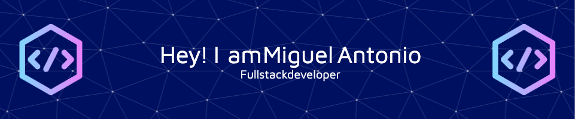

<!-- Header -->

  	

<!-- Profile Views -->

  

<!-- Other Stats -->

  

<!-- Language & Tools -->
### Languages & Tools

  

&nbsp;

  <!-- Activity Graph -->
  

<!-- Stats -->
<!---->

<!-- Languages -->

  

&nbsp;

  <!-- Trophies -->
  

<!--
**miguelantonio90/miguelantonio90** is a ✨ _special_ ✨ repository because its `README.md` (this file) appears on your GitHub profile.

Here are some ideas to get you started:

- 🔭 I’m currently working on ...
- 🌱 I’m currently learning ...
- 👯 I’m looking to collaborate on ...
- 🤔 I’m looking for help with ...
- 💬 Ask me about ...
- 📫 How to reach me: ...
- 😄 Pronouns: ...
- ⚡ Fun fact: ...
-->
